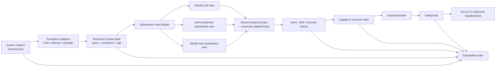

# Shūkai 论文 × Kihan 代码：Naruto Agent 架构思路与决策草案

状态：研究笔记 / 候选方案，**不是已批准的架构变更或实现工作单**
日期：2026-08-19
适用项目：`naruto_agent`
论文：[Advancing DRL Agents in Commercial Fighting Games: Training, Integration, and Agent-Human Alignment](https://arxiv.org/abs/2406.01103)（ICML 2024）
本地 PDF：`D:\projects\kihan\arxiv-2406.01103.pdf`

> 2026-08-22 决策更新：本笔记曾把 IQ 作为候选消融视图。ADR-016 已否决并从当前代码/架构
> 移除 IQ；当前只保留 IR 主模式和 SQ 身份不可靠时的降级模式。下文 IQ 内容保留为历史研究
> 过程，不代表当前设计。
PDF SHA-256：`85E1807D09F018EC21BD3C389AE25B572F4E90FAAF3199D9B0271CC3BE35B5A6`

## 1. 先给结论

Shūkai 对 `naruto_agent` **有架构启发，但不是可以直接搬用的实现**。

最值得吸收的不是“立刻上 PPO”，而是下面四个思想：

1. 把共享战斗知识和角色身份知识分开，并用身份消融验证泛化能力；
2. 把动作拆成多个语义头，再经过合法性掩码、调度器和安全门；
3. 用不同结构/目标的策略快照制造训练与评估多样性，而不是只反复打同一种对手；
4. 把胜率、战斗风格、反应延迟和错误率分开评价，不把“更强”误写成“更像人”或“更好玩”。

但论文和当前项目之间存在一个决定性的观测边界差异：论文使用游戏客户端内部状态，包含技能、Buff、实体、命中信息，甚至普通玩家不可见的 hitbox/hurtbox；`naruto_agent` 的硬约束是 **screen-only**。所以论文中 FIS/QS/FQS、PPO 结果和 HELT 的数值不能直接外推到本项目。

Kihan 更接近一个可运行的视觉原型集合：它证明了“屏幕裁剪 + HUD 规则 + 检测/分类 + 动作掩码”的方向具有工程价值；但其直接键盘控制、单帧向量、硬编码、数据同步、奖励和证据链都不适合作为 `naruto_agent` 主干。

当前最合理的方向是：**保留 `naruto_agent` 现有的分层安全架构，用 Kihan 的视觉启发补足感知，用 Shūkai 的身份消融、多头动作和异构策略思想设计后续实验。**

## 2. 证据边界

本文中的结论分为三类：

- **论文事实**：来自 Zhang 等人的论文正文、图表和附录；
- **代码事实**：来自对 `D:\projects\kihan` 的静态代码检查；没有执行其模型、训练或按键代码；
- **候选设计**：是对 `naruto_agent` 的推导，尚未成为 `ARCHITECTURE.md` 或 `DECISIONS.md` 中的正式决定。

本次没有：

- 启动 Kihan 训练或推理；
- 发送任何真实按键；
- 修改 `naruto_agent` 的运行时、训练代码或正式架构；
- 授权行为克隆、PPO、在线强化学习、自博弈或 world model；
- 验证原生截图、模拟器窗口聚焦或真实紧急停止链路。

## 3. 论文到底做了什么

### 3.1 三种信息结构

论文把输入拆成身份信息（ID）和数值属性信息，并比较三种结构：

| 论文结构 | 自己 | 对手 | 论文中的表现与含义 |
|---|---|---|---|
| FIS | ID + 属性 | ID + 属性 | 熟悉角色能力最高，但对陌生角色过度依赖身份，泛化下降 |
| QS | ID + 属性 | 仅属性 | 保留“我是谁”的技能控制，同时降低对手身份依赖；论文最终部署结构 |
| FQS | 仅属性 | 仅属性 | 身份无关性最强，但熟悉角色能力更低 |

论文报告的 Elo 不是本项目的目标值，只能说明一种趋势：

- 熟悉对手：FQS 890、QS 1323、FIS 1825；
- 陌生对手：FQS 850、QS 1300、FIS 1150；
- FIS 面对陌生角色下降约 36%，QS/FQS 相对稳定。

对本项目真正有用的假设是：**明确隐藏对手身份，可能迫使策略学习血量、距离、攻击阶段、技能可用性等战斗语义，而不是记住“角色 ID → 固定应对”。** 这必须通过我们自己的 screen-only 数据实验验证。

### 3.2 HELT：异构联盟训练

HELT 使用三类智能体：

- main agent：QS 或 FQS，持续训练，不重置；
- main exploiter：与 main agent 同结构，专门寻找当前 main agent 的弱点，每轮重置；
- league exploiter：FIS，利用身份信息寻找强烈的角色特定反制，部分概率重置。

训练过程中会保存策略快照，使用 PFSP 按历史胜率挑选对手，并使用 regret matching 调整对手角色分布。论文在其内部训练系统中报告：70 小时后 HELT 相比同构联盟提高 22%。

这里应当吸收的是“**不同归纳偏置的策略互相揭示盲点**”，而不是现在就照搬完整 HELT。当前项目只有三个初始角色、没有授权在线 RL，也没有证据表明能够同时可靠控制对战双方。

### 3.3 多头动作与动作掩码

论文的策略输出分成三个头：

- Move；
- Skill；
- Direction。

动作在发给客户端前应用 action mask。这与 `naruto_agent` 的分层要求高度一致，但我们的落地顺序必须是：

`PolicyOutput → ControlCommand/语义动作 → 技能合法性 → ActionScheduler → SafetyGate → InputBackend`

模型永远不能直接调用键盘接口。

### 3.4 Agent-human alignment

论文通过以下方式控制体验：

- 降低预测频率以模拟人类反应时间；
- 以一定概率执行动作，形成不同难度；
- 用 balanced / cautious / aggressive 奖励塑造风格；
- 用替身、奥义、突进、反击等语义指标分析人类与智能体行为。

本项目可吸收“可读、有限速、可配置难度和风格”的部分，但不能吸收任何“躲避玩家识别”或规避检测的目标。智能体只允许出现在训练模式、游戏自带 AI 练习、或与知情同意朋友的私人对局中。

### 3.5 论文结果为什么不能直接复现

论文的系统条件包括：

- 游戏客户端内部状态和不可见命中信息；
- 可控制的大规模并行环境；
- 每个智能体约 4 张 T4 与 3000 CPU 核，整个联盟约 12 张 GPU 与 9000 CPU 核；
- 一个使用全部信息和更大训练池的 oracle 作为评估对手；
- 生产级的大规模玩家数据和部署环境。

`naruto_agent` 只有正常玩家可见的屏幕信息，且有更严格的安全和使用范围。因此我们只能迁移抽象思想，不能宣称复现论文的样本效率、Elo、泛化或部署效果。

## 4. Kihan 代码提供了什么

### 4.1 当前可辨认的管线

Kihan 的主要路径可以概括为：

`MSS 截屏 → 固定区域裁剪 → HSV/形状规则 + YOLO + ResNet18 → 约 50 维单帧观测 → PPO MultiDiscrete → action mask → PyAutoGUI`

仓库中还包含：

- `kihanlook.py` / `blood/` / `time/`：HUD、血量、能量和计时识别实验；
- `cnn/`：ResNet18 分类器和权重；
- `a`、`a_over`、`a_simple`：数代 PPO 原型；
- `b_imitation`：键盘示范记录与行为克隆；
- `final/really_finall.py`：把感知、环境、奖励、按键与训练揉在一起的单体脚本。

### 4.2 可以借鉴的部分

| Kihan 组件/思想 | 价值 | 在 Naruto Agent 中的处理方式 |
|---|---|---|
| HUD 的 HSV、轮廓和区域规则 | 对固定 UI 往往比大模型更稳定、可解释 | 重新实现为感知适配器；输出值、置信度、时间戳和失效原因 |
| 分区域观察血量、能量、技能状态 | 提供了合理的结构化状态起点 | 映射到 `PerceptionState` / 后续 `CombatState`，不要直接拼匿名数组 |
| 检测器与分类器组合 | 可覆盖角色、召唤物、技能图标等离散视觉对象 | 先建立标注规范和离线基准，再决定是否使用现有权重 |
| 动作掩码 | 可阻止冷却中、资源不足或上下文非法的技能 | 放到技能系统与 scheduler 之间，并记录拒绝原因 |
| 行为克隆思路 | 可作为 RL 前的低风险初始化 | 只能使用同步、可追溯、来自允许环境的示范数据 |
| 模型健康检查与元数据 | 提醒我们需要训练产物完整性 | 改成版本化 manifest、哈希、数据谱系与评估报告 |

### 4.3 不应迁移的部分

| Kihan 现状 | 问题 | 决策建议 |
|---|---|---|
| 坐标、窗口、键位和路径硬编码 | 无法校准、迁移和验证 | 全部进入配置和 `CharacterSpec`，启动时验证 |
| 模型/环境直接调用 PyAutoGUI | 绕过 scheduler 与安全门 | 禁止进入主干 |
| 推理脚本关闭 PyAutoGUI failsafe | 放大失控风险 | 明确禁止 |
| 单帧约 50 维匿名向量 | 缺乏时间上下文、可解释性和缺失值语义 | 使用带置信度和年龄的结构化状态；只在 policy encoder 边界展平 |
| `time.time()` 驱动同步 | 非单调时钟会受系统时间调整影响 | 运行时统一 monotonic nanoseconds |
| NPZ 仅保存 observation/action | 帧、动作和结果难以精确对齐，缺少来源与版本 | 使用现有 `EpisodeRecorder` 扩展同步记录 |
| `final/really_finall.py` 返回累计奖励 | PPO 每步会重复计入历史奖励，可能破坏回报语义 | 不复用；奖励必须输出本步增量并有单元测试 |
| 提交权重、数据和大文件 | 来源、许可、版本和仓库体积不清晰 | 不复制；数据/权重进入外部 artifact store |
| 无测试、无可靠实验日志 | 无法区分“写了代码”和“真的工作” | 只以可复现测试和记录为依据 |

结论：Kihan 适合做 **算法与视觉原型参考库**，不适合被合并成 `naruto_agent` 的 runtime 或 learning 主干。

## 5. 候选架构：把论文思想翻译成 screen-only 系统

下面是建议的逻辑结构，不代表已批准实现：



### 5.1 不照搬 FIS/QS/FQS，而是定义屏幕版视图

建议定义三个实验视图，名称刻意与论文区分，避免暗示拥有论文的内部状态：

1. **Identity-rich view（IR）**
   - 自己：角色 ID + 可见属性；
   - 对手：只有识别置信度足够时提供角色 ID + 可见属性；
   - 用于测量身份信息对熟悉 matchup 的帮助。

2. **Self-conditioned quantitative view（SQ）**
   - 自己：配置中的角色 ID + 可见属性；
   - 对手：隐藏 ID，仅提供血量、距离、动作阶段、资源等估计；
   - 最接近论文 QS 的可行 screen-only 版本，建议作为主候选。

3. **Identity-free quantitative view（IQ）**
   - 双方角色 ID 都隐藏；
   - 用于测量共享战斗知识的下限和跨角色泛化。

三种视图应来自同一个版本化 `CombatState`，只由 view builder 决定哪些字段可见。这样可以做严格的成对消融，而不是维护三套数据管线。

### 5.2 建议新增的状态语义

每个观测量不应只是一个浮点数，而应携带：

```text
Estimate[T]
├── value: T | null
├── confidence: 0..1
├── observed_at_ns: monotonic timestamp
├── valid_until_ns: monotonic timestamp
├── source: detector/version/calibration id
└── reason_unavailable: optional enum
```

候选 `CombatState` 可包含：

- self/opponent health、energy、substitution/readiness；
- relative position、distance bucket、screen edge state；
- visible action phase：neutral / startup / active / recovery / hitstun / unknown；
- skill readiness 与 cooldown estimate；
- round/timer/end-state；
- active character、support/summon 的可见状态；
- 最近 N 个状态或由 GRU/状态估计器产生的 belief embedding。

不可从屏幕可靠观察的 hitbox、隐藏冷却、内部 Buff 和精确帧数据必须是 `unknown` 或估计值，不能伪装成真值。

### 5.3 动作表示

建议把论文的三个动作头翻译为语义意图：

```text
MultiHeadAction
├── movement_intent: neutral / left / right / jump / down / ...
├── skill_intent: none / basic / skill_slot / substitute / support / ultimate
├── direction_intent: neutral / 8-way / target-relative
├── desired_hold_ms
└── cancel_condition / deadline_ns
```

角色特定技能仍由 `CharacterSpec` 和 character adapter 映射；policy 不知道实际键位。合法性层至少检查：

- 资源是否足够；
- 技能是否被确认可用；
- 当前动作阶段是否允许；
- 状态是否过期或低置信；
- calibration/window focus/emergency stop 是否有效；
- 是否处于允许的训练或私人环境。

掩码不是安全门的替代品：模型可以收到 masked logits，但 scheduler 与 `SafetyGate` 仍必须独立拒绝非法输出。

### 5.4 共享与角色特定知识

建议采用混合结构：

- 共享：HUD/空间/节奏编码器、对手行为编码器、通用 neutral/defense/pressure 概念；
- 角色特定：`CharacterSpec`、技能可用性、时序、动作 adapter、可选 policy head；
- 实验开关：对手 ID dropout、自己 ID dropout、character head 冻结/替换；
- 新角色接入：先配置和校准，再训练小型 adapter/head，最后才考虑更新共享 backbone。

这比“三个角色各自一整套模型”更符合共享知识目标，也比“一个完全无角色语义的模型”更能表示角色机制差异。

## 6. 学习与评估路线（需要逐阶段授权）

### 阶段 A：屏幕观测基准，不控制游戏

- 使用允许环境中由用户拥有/授权的短录屏；
- 建立 health、energy、round state、relative position、visible action phase 的标签规范；
- 比较 Kihan 式规则、轻量检测器和分类器；
- 输出准确率、失败率、延迟、置信度校准与过期状态测试；
- 所有真实输入保持关闭。

### 阶段 B：时间状态与三视图消融，不训练控制策略

- 从同一 episode 生成 IR/SQ/IQ 三种 observation view；
- 测试 ID 是否泄漏到被隐藏的视图；
- 比较单帧、规则窗口、GRU 的状态预测质量；
- 验证低置信/过期观测一定进入 neutral/fail-safe。

### 阶段 C：同步示范数据与离线行为克隆

仅在新的工作单明确授权后进行：

- 示范必须是训练模式、游戏 AI 练习或知情同意的私人对局；
- 保存原始帧、单调时间戳、输入事件、状态估计、角色配置版本和校准版本；
- 训练先预测语义动作头，不直接预测键位；
- 固定随机种子、按 episode 切分，避免相邻帧泄漏；
- 报告动作头准确率、合法动作率、长尾技能召回率和校准误差；
- 离线指标不能证明实时控制可用。

### 阶段 D：dry-run 闭环和影子模式

- policy 读取实时屏幕，但只记录“本来会做什么”；
- 对每个动作记录 mask、scheduler 与 SafetyGate 的最终决定；
- 检查输入频率、按键持续时间、状态陈旧、窗口失焦和 emergency stop；
- 用录制回放验证确定性与可复现性。

### 阶段 E：有限的真实输入验证

需要单独明确授权，并且只能在允许环境中：

- 有效校准；
- 正确窗口焦点；
- 显式 `--allow-live-input`；
- 可验证的 emergency stop；
- 严格动作率/持续时间限制；
- 自动释放所有按键；
- 从最短、最小动作开始。

### 阶段 F：快照课程或联盟式训练

这是远期候选，不属于 Work Order 001：

- 先用 scripted opponent、固定游戏 AI 条件和历史策略快照建立 opponent pool；
- 没有同时控制双方时，不称为 self-play；
- 只有在环境可重复、评估可信、资源预算明确后，才评估 PFSP 或异构 exploiter；
- 不以论文的 22% 作为验收阈值。

## 7. 建议的核心实验

### 实验 1：对手身份是否伤害泛化

在同一数据、同一训练预算和同一网络规模下比较 IR/SQ/IQ：

- 熟悉角色/陌生角色分别切分；
- 角色皮肤、场景和 UI 变化单独切分；
- 报告总体指标和每角色指标；
- 检查 SQ/IQ 中是否仍可通过未屏蔽字段反推出角色 ID。

决策问题：如果 SQ 几乎保持 IR 的熟悉 matchup 能力，同时提高陌生角色表现，就把 SQ 作为默认 policy view。

### 实验 2：单帧向量还是时间状态

比较：

- Kihan 式单帧向量；
- 最近 N 帧结构化窗口；
- 规则 belief state + GRU。

重点不是只看动作准确率，而是看 startup/recovery/hitstun、技能是否结束、状态过期时能否安全输出 neutral。

### 实验 3：语义多头动作

比较扁平组合动作与 Move/Skill/Direction 多头：

- 合法组合比例；
- 稀有技能召回；
- 输出稳定性和按键抖动；
- character adapter 更换时是否需要重写共享策略。

### 实验 4：动作掩码的职责边界

逐层注入错误：

- policy 请求冷却中技能；
- 低置信状态；
- 过期帧；
- 窗口失焦；
- calibration 无效；
- emergency stop 激活。

验收点：mask、scheduler、SafetyGate 各自留下可审计的拒绝原因；最后无真实按键。

### 实验 5：能力、风格和公平性分开评价

建议指标：

- 能力：胜负、血量差、对不同 AI 难度/角色的稳健性；
- 合法性：无效技能率、被 mask 比例、scheduler 拒绝率；
- 时序：反应延迟、动作率、按键持续时间、重复动作；
- 行为语义：替身时机、反击、突进、资源使用、过度防守；
- 安全：失焦输出、陈旧状态输出、emergency stop 释放延迟；
- 泛化：训练内角色与保留角色的差距。

“像人”不能只由低反应速度或随机丢动作证明；应当先定义可观察、可审计的行为目标。

## 8. 奖励设计警告

论文附录的核心血量奖励是相邻时间步的自身/对手血量变化，属于 **step delta**。Kihan `final/really_finall.py` 中多处分支返回 `cumulative_reward`，这会让旧奖励在后续每个 step 被重复纳入 PPO 回报，不能直接沿用。

未来若授权 RL，奖励接口至少应满足：

- 每步只返回本步增量；
- 奖励项有独立名称、单位、上下限和版本；
- health delta、terminal outcome、style objective 分开记录；
- 对识别抖动、掉帧和 round reset 有单元测试；
- 训练奖励不等于评估指标；
- 不能用高频按键或拖延比赛轻易刷分。

在 screen-only 条件下，血条抖动会直接污染奖励，所以在感知基准稳定前不应启动在线 RL。

## 9. 明确不采用的内容

以下内容不应进入 `naruto_agent`：

- 游戏内存、客户端内部状态、注入、hook、封包或协议逆向；
- 普通玩家不可见的 hitbox/hurtbox 真值；
- 排位、公开匹配或与不知情的人对战；
- 反作弊规避、检测绕过或伪装成人类以逃避识别；
- model → PyAutoGUI 的直接调用；
- 默认开启真实输入；
- 把 Kihan 已提交权重或数据复制进 Git；
- 把论文 oracle、Elo、22% 样本效率或生产规模当成本项目已验证能力；
- 在 Work Order 001 内启动 BC、PPO、在线 RL、自博弈、伪标签或 world model。

## 10. 需要你做的架构决定

建议按顺序做，而不是一次决定所有训练技术：

1. **默认 observation view**：是否接受 SQ（自己带角色身份、对手隐藏身份）作为未来主候选，并保留 IR/IQ 做消融？
2. **状态表示**：是否接受“结构化 `CombatState` + temporal belief”，而不是把 50 维数组作为系统契约？
3. **策略结构**：是否接受“共享 temporal backbone + 角色 adapter/head”的混合方案？
4. **动作契约**：是否将 `ControlCommand` 演进为 Move/Skill/Direction 语义多头，同时保持 scheduler 和 SafetyGate 是唯一输入路径？
5. **Kihan 迁移范围**：是否只迁移 HUD/视觉思想和 action-mask 测试，不迁移训练、按键、奖励和权重？
6. **下一工作单范围**：先做纯离线感知与 observation-view 基准，还是先扩展 episode schema？推荐前者和最小必要 schema 同步推进，但仍不训练控制策略。
7. **联盟路线**：是否把 HELT 定位为远期研究方向，近期只构建可审计的 opponent/snapshot evaluation registry？

## 11. 推荐的近期工作单边界

如果上面的方向被接受，建议下一份工作单只做：

> 建立 screen-only 感知基准、带置信度的 temporal `CombatState` 草案、IR/SQ/IQ observation-view builder，以及合成/离线测试；不训练策略，不发送真实输入，不修改安全门授权条件。

这一步能回答最关键的问题——“我们到底能从屏幕可靠知道什么”——也为后续行为克隆、角色共享和论文式身份消融提供可信数据基础。

## 12. 参考位置

论文：

- 摘要与总体贡献：[arXiv:2406.01103](https://arxiv.org/abs/2406.01103)
- FIS/QS/FQS：论文 §3.1、Figure 3、Appendix C.1；
- HELT：论文 §3.2、Figure 2、Appendix C.2-C.4；
- agent-human alignment：论文 §3.3、§5、Appendix B；
- 结果与训练资源：论文 §4、Figure 4、Appendix C.4、D；
- 奖励与动作空间：Appendix A；
- 超参数：Appendix D.1。

Naruto Agent 的既有约束：

- `docs/ARCHITECTURE.md`：模块边界、时间状态、共享/角色特定知识、禁止模型直接调用输入；
- `docs/SAFETY_AND_SCOPE.md`：允许环境、实时输入前置条件和 Git 数据边界；
- `docs/CODEX_WORK_ORDER_001.md`：当前工作单明确排除 BC、PPO、在线 RL、自博弈和 world model；
- `src/naruto_agent/core/contracts.py`：`FramePacket`、`PerceptionState`、`ControlCommand`、`PolicyOutput`；
- `src/naruto_agent/runtime/safety.py`：`ActionScheduler` 和 `SafetyGate`；
- `src/naruto_agent/data/recorder.py`：现有 `EpisodeRecorder`。

Kihan 重点参考：

- `D:\projects\kihan\kihanlook.py`：HUD 视觉规则；
- `D:\projects\kihan\a_simple\main_training.py`：单帧观测、MultiDiscrete、action mask 和直接输入；
- `D:\projects\kihan\a_simple\run_inference.py`：推理与 PyAutoGUI 配置；
- `D:\projects\kihan\b_imitation\data_recorder.py`：示范记录原型；
- `D:\projects\kihan\b_imitation\bc_train.py`：行为克隆原型；
- `D:\projects\kihan\final\really_finall.py`：单体环境与累计奖励问题。
